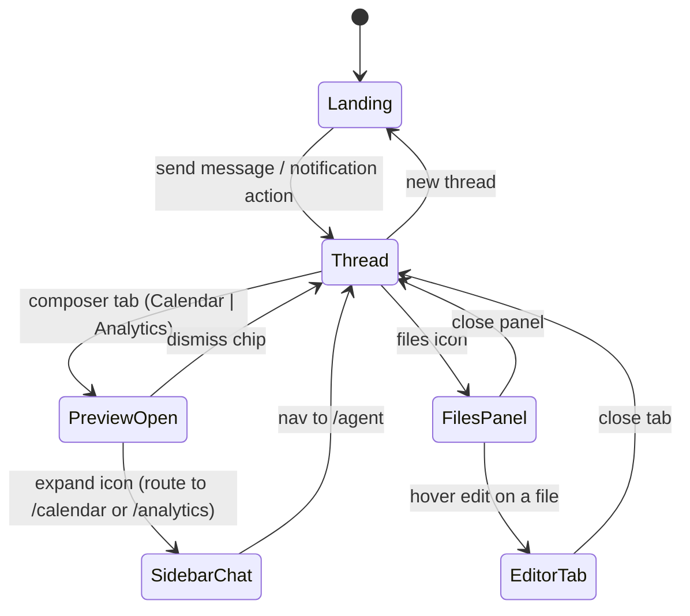
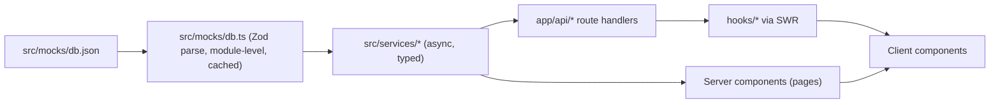

# Imagine AI Redesign — Implementation Plan

Companion to `PROJECT.md` (rules) and `SCHEMA.md` (data). This document decides
architecture, design tokens, motion, mock data, and build order. It contains no code.
Where `PROJECT.md` and a wireframe disagree, the wireframe wins on layout and behavior;
`PROJECT.md` wins on visual rules.

Skills to keep open while implementing: `.agents/skills/mastering-typescript`,
`.agents/skills/vercel-react-best-practices`, `.agents/skills/shadcn`,
`.cursor/skills/motion`. Motion+ audits (`MotionScore`) require the `motion-plus` MCP
sign-in; run them at the end of each UI phase if available.

Hard rules for the implementer:

- **Open and analyze the wireframe images before building each screen.** At the start of
every UI phase, read the PNG files listed in that phase's "Wireframes" line (and
`pink-application.png` for color density), and check the built screen against them before
marking the phase done. Follow the general structure and behavior; interpret the rest
and make it look great.
- You can reference the current app imagine-app but dont copy the code, we are making a new clean version and porting over business logic and agent after this is built. Only `SCHEMA.md` carries over.
- One mock JSON file. Nothing else fabricates data inline.
- Animation library is Motion (`motion` package, imported from `motion/react`). Framer
Motion is the same library under its old name; never install or import `framer-motion`
alongside it. Motion drives every interaction in this plan.
- Icons are Font Awesome Pro 7, **Sharp** family, Regular style, loaded once via the Kit
CSS embed in `src/app/layout.tsx` (see `PROJECT.md`). Sharp Regular is the default;
Sharp Solid is for active/selected only; Brands is for the LinkedIn logo only. No Lucide,
no Material Symbols. Feature code uses the centralized `Icon` component, never raw
`fa-` classes.
- No inline styles, no raw color values outside the token file.
- No em dashes in any product copy or mock data (labels, headings, descriptions,
placeholders, toasts, JSON strings). Use a period, comma, or colon instead.
- Every element, click and transition has motion animations
- **Stop at the end of every phase and wait for review.** Do not start the next phase
until the user has looked at the result and said to continue. Each stop includes a short
summary of what was built and the exact `localhost` URLs to open.
- **Keep the dev server running.** Start `pnpm dev` in Phase 0 and leave it up. Before
every review stop, confirm `http://localhost:3000` responds and the pages for that phase
render without console errors. If the server has died, restart it before handing off.
- **Always commit and push.** After every phase (and after any other completed chunk of
work), commit on `main` with a short message that says why, then `git push` to origin.
Do this before the review stop so the user can see the work on GitHub. Do not force-push.

---

## 1. Wireframe notes

The wireframes fix structure and behavior, not visual polish. They are screenshots, so
anything cut off at the frame edge is the crop, not the design: the calendar is a full
week, lists continue, columns are complete. Read each image, keep its general structure,
interpret the details, and make it look great within the `PROJECT.md` rules.

### Shell

Left sidebar (logo, primary action, Agent / Calendar / Analytics / Files, a Posts list,
user footer) rounding into the main surface, with an optional right column. When the
file system panel is open the sidebar collapses to icons.

### Landing (`landing/landing(agent).png`)

After onboarding the user lands here. It shows everything the agent has done: drafts that
have not been scheduled, updates on what the agent did while they were away, and some
analytics to spark ideas for what to post next. A prompt box sits at the top. Clicking
one of the buttons on a notification sends that action off to the agent.

### Chat (`agent/agent.png`, `agent/agent-interaction.png`)

When the user types into the prompt box and sends, the UI moves down into a chat
interface with a smooth animated transition, not a flash to a new static page. The agent
answers with charts, graphs, and graphics for when a post is scheduled or drafted. A
drafted post looks like a real LinkedIn post and can be edited in chat. A file icon in
the top-right corner opens the file system sidebar. The agent has a distinct thinking
state, not a generic spinner.

### Calendar and analytics in chat (`agent/calendar - in agent chat.png`, `agent/analytics - in agent.png`)

The chat bar has two options, Calendar and Analytics, that show a preview of the calendar
or analytics above the input. Clicking the expand button brings the user to the full page
and the chat transitions into the right sidebar with a clean animated transition. All of
this data is mocked.

### Calendar page (`calendar/calendar page.png`)

Navigation and view controls, search, a grid of scheduled and drafted posts, and the chat
in the right sidebar.

### Analytics page (`analytics/analytics-page.png`)

Range and profile controls, headline stats, impressions over time, breakdowns by post
type and by profile, and top posts.

### File system (`file-system/file system - right sidebar.png`, `file-system/editing file - opens tab.png`)

A Google Drive-like interface with markdown files and a section for assets (pictures and
videos). There are files for the organization and for individuals, plus a Skills tab.
Hovering a file reveals edit; editing opens a tab next to the agent where the markdown
can be read and changed. After saving, closing the tab returns to the chat.

### Settings (`settings/settings - profiles.png`, `settings/settings - integrations (like crm).png`)

Tabs for General, Profiles, Integrations, and API. Profiles lists the LinkedIn identities
the organization manages with a detail pane. Integrations shows connected services such
as the CRM and others available to add.

### Onboarding (`onboarding/Sign-in.png`, `onboarding/step-1.png` to `step-3.png`)

Sign-in with a pink brand panel, then three steps (organization, invite team, connect
LinkedIn) with a stepper.

All interactions have clean motion animations and animated page transitions, like Apple.

---

## 2. Decisions where the wireframes are open

- **Analytics is a top-level route.** `PROJECT.md`'s tree omits it, the nav includes it.
Add `app/(workspace)/analytics/page.tsx`.
- **Onboarding is the entry point.** `/` sends a new user to `/sign-in`, then through
`/onboarding/organization`, `/onboarding/team`, `/onboarding/linkedin`, and finishes on
the landing at `/agent`. An onboarded user (mock flag) goes from `/` straight to
`/agent`. These live in an `(auth)` route group with their own layout (no workspace
shell).
- **Route groups are folder names only.** `(auth)` and `(workspace)` are Next.js route
groups: the parentheses keep them out of the URL. `(workspace)` holds every signed-in
screen (agent, calendar, analytics, files, settings) and its shared layout; nothing is
called or labeled "dashboard".
- `**/agent` is the landing.** Landing and thread are two modes of one persistent
workspace, not two pages, so the composer can morph. Threads get a URL
(`/agent/[threadId]`) via history replacement after the animation, without remounting.
- **Chat is owned by the workspace layout, not by pages.** Its placement (main column,
right sidebar, hidden) derives from the route. This is what lets the thread move from
center to sidebar with `layoutId` across `/agent` → `/calendar` and `/analytics`.
- **Settings tabs are routes:** `/settings` (General), `/settings/profiles`,
`/settings/integrations`, `/settings/api`. Billing (`subscriptions`, `org_usage`) is a
section on General; the `billing/` route in `PROJECT.md`'s tree is not built unless
asked.
- `**/files` is a full-page version of the files panel** (same tree component, wider
preview column). The Files nav item goes there; the chat's file icon opens the panel.
- **Stat tiles and chart blocks are not cards.** They sit on the main surface separated
by spacing; where grouping is needed, a single soft `imagine-surface-raised` wraps the
group, never one border per tile.
- **Pink is the secondary/accent token, not the primary button color.** Every primary
button in the wireframes is near-black (`imagine-primary`). Pink
(`imagine-secondary`) appears exactly where `pink-application.png`
shows it: logo tile, active nav item, timeline dots, avatar tile, chart fills, brand
panel on sign-in.
- **"Posts" in the sidebar lists recent agent threads** (`mastra_threads`), titled by the
post they concern.
- **Markdown files live in the Mastra workspace**, not in `assets`. Files are modeled
from `workspace_search` rows grouped by `metadata.sourceFile`, scoped by
`metadata.orgId` (organization section) or `resourceId` (person sections). Assets are
`app.assets`. The Skills tab lists `mastra_skills`. A client's persona is a file in
that client's section, which is what "View in Files" opens.
- **"New post" sidebar action** focuses the composer with a drafting prefill and, if not
on `/agent`, navigates there first.

---

## 3. Architecture

### Routes

- `/`: redirects to `/sign-in` or `/agent` based on the mock onboarding state
- `(auth)`: `sign-in`, `onboarding/organization`, `onboarding/team`, `onboarding/linkedin`
- `(workspace)`: `agent`, `agent/[threadId]`, `calendar`, `analytics`, `files`,
`settings`, `settings/profiles`, `settings/integrations`, `settings/api`
- `api`: `agent`, `calendar`, `analytics`, `files`, `settings` route handlers that read the
mock JSON through the service layer. Hooks fetch these with SWR so the swap to live data
is a service-file change.

### Workspace shell state

- `WorkspaceProvider` (client, in the workspace layout) holds: `mode`
(`landing | thread`), `activeThreadId`, `composerPreview` (`none | calendar | analytics`), `filesPanelOpen`, `editorTabs`, `chatPlacement` (derived from pathname:
`main` on `/agent*`, `sidebar` on `/calendar` and `/analytics`, `hidden` elsewhere).
- The layout renders: `Sidebar`, `MainSurface` (route `children`), `ChatColumn` (the
thread + composer, positioned by `chatPlacement`), `FilesPanel`. All four are inside one
`LayoutGroup` so shared `layoutId`s resolve across route changes.
- Pages render only their own content and stay thin (data selection + composition).

### Data flow

- Services are `async` and return typed domain objects even though the source is
synchronous JSON. This is the seam for Supabase later.
- Selectors (analytics rollups, calendar grouping, file tree building) are pure functions
in `services/*` with unit tests.

### Folder additions to `PROJECT.md`'s tree

- `src/mocks/db.json`, `src/mocks/db.ts` (schema + parse + `React.cache` loaders)
- `src/components/ui/icon.tsx` (Font Awesome Pro Sharp wrapper)
- `src/components/features/analytics/*`, `src/components/features/onboarding/*`
- `src/components/layout/*` (Sidebar, MainSurface, ChatColumn, FilesPanel, RightRail)
- `src/components/motion/*` (PageTransition, Stagger, Pressable, Shimmer, Thinking)
- `src/styles/motion.ts` (transition presets), `src/styles/tokens.ts`
- `src/app/(auth)/layout.tsx`, `src/app/(workspace)/template.tsx` (page transition)

---

## 4. Design system

### Color tokens (`src/styles/tokens.ts` → CSS variables in `globals.css` via `@theme`)

Sample exact hex values from the PNGs during Phase 1; approximate readings below.

Light (`pallete-light.png`, left to right): white, `#F5F4F3`, `#E9E5E4`, `#F4A0A6`,
`#D9727E`, `#2C2C2F`, `#1C1C1E`. Page background behind the swatches `#EDECEA`.

Dark (`pallete-dark.png`): `#1B1B1B`, `#232326`, `#2F2F32`, `#6B6661`, `#4F4F53`,
`#D3747F`, `#F1F0EE`.

Semantic tokens (each resolves in light and dark from a single `data-theme` switch).
Names describe the role, never the hue, so a future theme swaps values without renaming
anything. Today's values are listed only as the starting point:

- `imagine-background` — page and sidebar background (light: `#EDECEA`; dark: `#1B1B1B`)
- `imagine-surface` — main raised surface (light: white; dark: `#232326`)
- `imagine-surface-raised` — grouped blocks, chart backgrounds, composer (light:
`#F5F4F3`; dark: `#2F2F32`)
- `imagine-border` — the few hairlines that exist (light: `#E9E5E4`; dark: `#2F2F32`)
- `imagine-foreground` — primary text (light: `#1C1C1E`; dark: `#F1F0EE`)
- `imagine-foreground-muted` — secondary text (light: `#6B6661`; dark: `#9A948F` derived)
- `imagine-foreground-faint` — placeholders, skeleton base (light: `#B9B3AF` derived;
dark: `#4F4F53`)
- `imagine-primary` — primary action fill: buttons, selected chips (light: `#1C1C1E`;
dark: `#F1F0EE`)
- `imagine-primary-foreground` — text and icons on primary (light: `#F1F0EE`; dark:
`#1B1B1B`)
- `imagine-secondary` — brand accent, currently pink (light: `#D9727E`; dark: `#D3747F`)
- `imagine-secondary-soft` — accent tint for active nav, logo tile, chart fills (light:
`#F4A0A6` at low alpha over surface; dark: `#D3747F` at low alpha)
- `imagine-secondary-strong` — timeline "new" dot, current onboarding step
- `imagine-secondary-foreground` — text on solid secondary surfaces (sign-in brand panel)

Accent budget (from `pink-application.png`): logo tile, active nav background + label,
unread timeline dots, avatar tile, chart bar fills, the "or" rule on sign-in, and the
sign-in brand panel. Nowhere else. Primary buttons are `imagine-primary`, never
`imagine-secondary`.

Non-palette states (`destructive`, `warning`, `success`) come from Tailwind's `red`,
`amber`, `emerald` scales, mapped once in `globals.css`.

### Spacing tokens

`imagine-spacing-xxs` 2, `xs` 4, `s` 8, `m` 12, `l` 16, `xl` 24, `xxl` 32, `xxxl` 48,
`section` 64 (px). Tailwind utilities alias these so `gap-l` works.

### Radius

`imagine-radius-control` 6px (buttons, inputs, chips), `imagine-radius-panel` 12px
(composer, previews, grouped blocks), `imagine-radius-surface` 20px (main surface corner
where the sidebar rounds in, right panels). No square outlines anywhere.

### Type

DM Sans via `next/font/google`, variable weight, `display: swap`. Scale: `display` 28/34,
`title` 20/28, `heading` 16/24, `body` 14/22, `small` 12/16, `micro` 11/14 with letter
spacing for the calendar column headers. One family, no eyebrows.

### Icons

Follow `PROJECT.md` exactly. Font Awesome Pro 7 Sharp via the Kit stylesheet
(`https://kit.fontawesome.com/70369a3baa.css`) loaded once in `src/app/layout.tsx`. Names
come from [Sharp Regular](https://fontawesome.com/search?ip=sharp&s=regular).

- One `Icon` component: typed `name` (string literal union of icons actually used), plus
`size` from tokens. It renders `fa-sharp fa-regular` by default, `fa-sharp fa-solid` when
`active`, and `fa-brands` only for LinkedIn.
- Feature code never writes `fa-` classes. Size and color come from `imagine-*` tokens,
never `fa-lg` / `fa-2x` or a hardcoded color. Animation is Motion, not `fa-spin` /
`fa-beat`.
- The Kit only carries Sharp Regular, Sharp Solid, and Brands. Do not use other FA styles.
- shadcn components that ship with `lucide-react` are rewritten to use `Icon`. An ESLint
`no-restricted-imports` rule blocks `lucide-react`, `material-symbols`, and the legacy
`framer-motion` package name (use `motion/react`).

### Components

shadcn is initialized (Radix base, Tailwind v4) and then every added component is
customized: token colors only, 6px control radius, no default ring/outline, DM Sans,
motion added via Motion. Add only what the wireframes need:

- `button` (primary, soft, ghost, outline-rare, destructive; icon slot via `data-icon`)
- `input`, `textarea`, `input-group` (composer), `field` (forms)
- `tabs` (settings, files panel, editor tab strip), `toggle-group` (Day/Week/Month,
7d/30d/90d)
- `dropdown-menu`, `select` (All profiles, role), `popover`, `tooltip`
- `avatar`, `badge` (status only), `skeleton` (rewritten with shimmer sweep), `spinner`
(kept for buttons only, never for the agent)
- `sheet` → replaced by an in-flow `Panel` for the files sidebar (pushes content, does
not overlay)
- `dialog`, `alert-dialog` (Remove profile), `sonner` (toasts with spring entrance)
- `chart` (Recharts wrapper) for bar, area, and horizontal bar
- `message-scroller`, `message`, `bubble`, `attachment`, `marker` for the thread
- `separator` only inside the Marker; no section dividers
- `scroll-area` for the files tree and settings lists
- `command` inside `dialog` for search in the files panel

Custom, not from a registry: `Sidebar` (the shadcn sidebar reads as shadcn; build a thin
one), `Composer`, `PreviewSurface`, `Timeline`, `StatTile`, `CalendarGrid`, `PostChip`,
`LinkedInPostDraft`, `ScheduledGraphic`, `AssetGrid`, `FileTree`, `MarkdownEditor`,
`Stepper`, `ThinkingIndicator`.

### Menu selection

Nav selection is a soft `imagine-secondary-soft` pill that slides between items with a
shared `layoutId` (one moving indicator, not a highlight applied per item). Text goes to
`imagine-secondary`, icon fills. Hover lifts the label color with no background. Same
indicator pattern for settings tabs and files-panel tabs, in `imagine-foreground`
instead of the accent.

---

## 5. Motion specification

All from `motion/react` (client components) or `motion/react-client` (server). Presets in
`src/styles/motion.ts`; nothing sets a duration inline.

Presets:

- `spring.snappy` — `type: spring, stiffness 500, damping 40` for indicators, chips, press
- `spring.soft` — `bounce 0.15, visualDuration 0.4` for panels, morphs, previews
- `duration.fast` 0.15, `duration.base` 0.2, `duration.slow` 0.3 with `ease.out`
- `stagger.list` 0.04s per item, `stagger.grid` 0.02s
- `press` — `whileTap scale 0.97` with `spring.snappy`
- `hoverLift` — `whileHover y -1` and color shift; cursor-aware glow only on nav, primary
buttons, and the few cards (pointer position drives a radial via a MotionValue,
read in `useTransform`, never in render)

Choreography per interaction:

- **Landing → thread**: composer has `layoutId="composer"`. On send, the header, timeline,
and calendar strip exit with `opacity 0, y 12, filter blur(6px)` over `duration.base`;
the composer morphs to the bottom dock with `spring.soft`; the user bubble enters from
the composer position; the thinking indicator appears; the URL is replaced. Nothing
blocks input during the transition.
- **Notification action**: the action button presses, its entry collapses (height +
opacity), and the same landing → thread choreography plays with the intent as the
first message.
- **Preview open/close**: `PreviewSurface` shares `layoutId="preview-surface"` with the
composer frame; opening grows it upward with `spring.soft`; content inside enters with
`stagger.grid`. Dismiss reverses. Calendar and analytics previews use
`Activity` so state persists when hidden.
- **Expand to page**: on click, route to `/calendar` or `/analytics`. The full page's grid
or chart block carries the same `layoutId` as the preview, so Motion morphs the frame
into the page. Simultaneously `chatPlacement` becomes `sidebar` and `ChatColumn`
(`layoutId="chat-column"`) slides right and narrows. The sidebar composer keeps
`layoutId="composer"`.
- **Files panel**: `Panel` enters from the right by width (in-flow, main surface
compresses with `layout`); the left sidebar collapses to icons in the same beat. Tree
sections stagger; asset tiles use `stagger.grid`.
- **Editor tab**: tab strip appears with height animation; thread content exits left, the
document enters right; Save shows an inline confirmation; closing reverses.
- **Route changes**: `(workspace)/template.tsx` wraps pages in a fade + 4px slide over
`duration.fast`–`duration.base`. Elements that carry a `layoutId` are excluded from this
fade so morphs stay clean.
- **Lists and grids**: timeline entries, calendar cells, stat tiles, top posts, settings
rows, tree nodes all use `stagger.list` or `stagger.grid` on first mount only.
- **Skeletons**: a gradient sweep (`imagine-surface-raised` → `imagine-surface` →
`imagine-surface-raised`) moving left to right on a 1.4s loop; `shimmer` utility for
text placeholders.
- **Toasts**: spring in from the bottom right, fade on dismiss.
- **Thinking state**: a pink hairline under the agent's avatar that breathes in width,
paired with rotating status text ("Reading your calendar", "Drafting") using the
`shimmer` utility, and the message body streaming in per block. No spinner.
- **Reduced motion**: `useReducedMotion` swaps morphs for fades and disables stagger.

Performance rules from the motion skill: prefer `transform`/`opacity`; independent
transforms only when values are MotionValues or compete; `willChange` set for the
duration of a morph and removed after; no MotionValue reads in render; no allocation in
frame callbacks.

---

## 6. Mock data

### File

`src/mocks/db.json`. Top-level keys are Postgres schemas; second level is table names;
values are arrays of rows using exact `SCHEMA.md` column names and types. Timestamps are
ISO strings. `Json` columns hold the shapes listed below.

### Tables included and why

- `public.users` — 5 humans (Sarah Chen is the signed-in user)
- `app.organizations` (1), `app.organization_members` (5, roles `owner | admin | member`)
- `app.clients` — 7 LinkedIn identities (1 company page, 6 people) with `persona` text,
`is_company`, `status`, `profile_picture_path`
- `app.client_linkedin_auth` — one per client, mixed `status` (`connected | expired`)
- `app.client_posts` — ~60 posts across 90 days: `status` in `draft | scheduled | published | failed`, `scheduled_at` spread across the current and next month,
`media` as an array of `{ path, mime_type, alt }`, `analytics` as
`{ impressions, reactions, comments, shares, follower_delta, daily: [{ date, impressions, engagements, followers }] }`, `post_label` from
`organizations.post_label_options`
- `app.assets` — ~40 images and 4 videos with `mime_type`, `caption`, `used_count`
- `app.engagement_profiles`, `app.engagement_profile_tags`, `app.engagement_comments`,
`app.engagement_reactions` — enough to render "By profile", top engagers, and CRM
matches
- `app.crm_connections` (1, provider `hubspot`), `app.crm_accounts`, `app.crm_contacts`,
`app.crm_opportunities`, `app.crm_stages` — small sets for the integrations tab and
for "deals traced to a first content touch"
- `app.subscriptions`, `app.org_usage`, `app.api_keys` — settings General and API tabs
- `app.targeted_accounts`, `app.comment_suggestions` — a few rows so the timeline can
show "suggested 3 comments" activity
- `agent.activities` — ~12 rows for "While you were away": `activity_type` in
`drafted_post | scheduled_post | published_post | suggested_comments | flagged_engager | crm_match | persona_updated`; `metadata` carries the referenced ids,
a one-line summary, the two action labels, and `seen: boolean`
- `mastra.mastra_threads` — 6 threads (`title` = post-oriented), `resourceId` = Sarah's
user id
- `mastra.mastra_messages` — one fully populated thread demonstrating every message
part; others short
- `mastra.workspace_search` — file rows grouped by `metadata.sourceFile`; org files
(`metadata.orgId`) and per-person files (`resourceId`): brand voice, content pillars,
ICP, weekly plan, each client's persona, a nested "campaigns" folder
- `mastra.mastra_skills` — 5 named skills for the Skills tab

### Message content shape (`mastra_messages.content`)

A discriminated array of parts: `text`, `emphasis`, `chart` (`kind: bar | area | hbar`, series, labels), `image_pair`, `post_draft` (references a `client_posts.id`,
holds the editable body and media), `scheduled` (post id, date, chip actions),
`asset_picker` (asset ids), `calendar_preview`, `analytics_preview`. The agent renderer
switches on `type` exhaustively.

### Derived, not stored

Computed by pure selectors in `services/*` and tested:

- Landing stats and right-rail chart from `client_posts.analytics`
- "Up next" and "Next two weeks" from `client_posts` where `status = scheduled`
- Calendar grouping by day, by view (day/week/month)
- Analytics summary for 7d/30d/90d (mirrors `analytics_posts_summary`), by post type
(from `post_label`), by profile (from `client_id`), top posts by impressions
- File tree from `workspace_search` groups plus `assets`, with org and person sections
- Settings profile detail (client + auth + indexed post count + persona file path)

### Validation and types

`src/mocks/db.ts` declares a Zod schema per table, parses the JSON once at module level
(hoisted static I/O), and exports `React.cache`d loaders. `src/entities/*` derive their
types from these schemas with `z.infer`, then narrow for the UI (for example
`ScheduledPost` picks `id, client_id, content, scheduled_at, status, media`). Literal
unions for status fields; no enums. Parsing failure fails the build via a Vitest test
that loads the file.

---

## 7. Code conventions

TypeScript (from `mastering-typescript`):

- `strict`, `noUncheckedIndexedAccess`, `exactOptionalPropertyTypes`, ESM, `moduleResolution: bundler`; ESLint 9 flat config with `strictTypeChecked`; Prettier; Vitest.
- `satisfies` for token maps and variant maps; discriminated unions with exhaustive
`switch` for message parts, activity types, chat placement; `unknown` at boundaries,
Zod to narrow; `Result` return type from services that can fail.
- No `as` casts outside test fixtures; no `any`; no enums; no default exports except
Next.js page/layout files.

React and Next.js (from `vercel-react-best-practices`):

- Pages are server components that call services in parallel (`Promise.all`) and pass
only the fields the client needs. Client components are leaf-level and marked
`"use client"`.
- Suspense boundaries per section (timeline, calendar strip, right rail) with shimmer
skeletons as fallbacks.
- `useTransition` for send and save; `Activity` for hidden previews; functional
`setState`; no components defined inside components; no derived state in effects;
`useEffectEvent` for stable handlers; `content-visibility` on long threads and the
files tree.
- Chart library loaded with `next/dynamic` and preloaded on hover of the Analytics nav
item and the composer's Analytics tab.
- Theme switch uses the inline-script pattern to avoid flicker and hydration mismatch.
- SWR for client-fetched data (`useAgent`, `useCalendar`, `useFileSystem`,
`useSettings`), deduped by key.

shadcn (from the shadcn skill):

- `className` for layout only; `cn()` for conditionals; `gap-*` not `space-*`; `size-*`
for squares; `Field`/`FieldGroup` for forms; `ToggleGroup` for option sets; icons via
`data-icon`; `MessageScroller` owns thread scrolling; `Skeleton`, `Empty`, `Alert`,
`Badge` instead of custom markup; `Dialog` and `AlertDialog` always have titles.
- After `npx shadcn@latest add`, read each file, replace `lucide-react` with `Icon` (Font
Awesome Sharp),
strip default colors and radii in favor of tokens, and record the change in a short
comment header so upstream diffs stay reviewable.

---

## 8. Build order

Phases follow the user's path through the product: entry and onboarding first, then the
landing, then everything reachable from it. Each phase ends with `typecheck`, `lint`,
`test`, a visual pass in light and dark, confirmation that the dev server is up, and a
**review stop**: commit and push, summarize what was built, list the `localhost` URLs to
open, and wait for the user before continuing.

### Phase 0 — Scaffold and toolchain

- Create the Next.js App Router app in `src/` with TypeScript, Tailwind v4, ESLint;
set `packageManager` to pnpm.
- Apply the strict `tsconfig` and ESLint flat config from the TypeScript skill assets;
add Prettier and Vitest.
- Install `motion`, `swr`, `zod`, `recharts` (via shadcn `chart`). Do not install
`material-symbols` or `lucide-react`. Font Awesome comes from the Kit CSS embed.
- `npx shadcn@latest init` (Radix base, Tailwind v4, CSS variables). Do not add
components yet.
- Add the `no-restricted-imports` rule for `lucide-react`, `material-symbols`, and the
legacy `framer-motion` name (all animation imports come from `motion/react`).
- Start `pnpm dev` and leave it running for the rest of the build.
- Done when: `http://localhost:3000` renders the empty app, lints clean, a smoke test
passes.

### Phase 1 — Design system

Wireframes: `pallete-light.png`, `pallete-dark.png`, `pink-application.png` (sample exact
hex values from the first two; the third fixes how much pink is allowed).

- `styles/tokens.ts` with the color, spacing, radius, and type tokens above; emit to
`globals.css` under `@theme` for light and dark via `data-theme`; map Tailwind state
colors.
- DM Sans via `next/font`; type scale utilities.
- Kit CSS embed in the root layout; `Icon` component (Sharp Regular default, Solid for
active, Brands for LinkedIn) and the typed icon-name union.
- `styles/motion.ts` presets and `components/motion/*` (`PageTransition`, `Stagger`,
`Pressable`, `Shimmer`, `ThinkingIndicator`).
- Add and customize: `button`, `input`, `textarea`, `input-group`, `field`, `tabs`,
`toggle-group`, `dropdown-menu`, `select`, `popover`, `tooltip`, `avatar`, `badge`,
`skeleton`, `spinner`, `dialog`, `alert-dialog`, `sonner`, `scroll-area`, `separator`,
`command`, `chart`, `message-scroller`, `message`, `bubble`, `attachment`, `marker`.
- Theme switch with the no-flicker inline script.
- Feature components under `components/features/*` and `components/layout/*` for every
element the wireframes call for (composer, timeline, post chip, stat tile, chart block,
post draft, scheduled graphic, sidebar, files panel, and so on). Wireframes give the
structure and idea only; the built component must be high fidelity and distinctly
Imagine, with an elevation system (`shadow-control`, `shadow-raised`,
`shadow-floating`, `inset-shadow-highlight`) instead of drawn borders.
- A hidden `/dev/kit` route (excluded from production) that renders every primitive and
every feature component in isolation, in each of its states, both themes, for review.
The kit shows components, not pages. Page composition is Phase 2 and later.
- Done when: no component references a raw color, radius, `lucide-react`, or Material
Symbols; icons render via `Icon` in Sharp Regular; the kit route passes a visual check
against `pink-application.png` density.

### Phase 2 — Mock data, entities, services, API

- Author `mocks/db.json` per section 6; write `mocks/db.ts` (Zod, parse once,
`React.cache` loaders).
- `entities/*` types derived from schemas.
- `services/*` with the selectors listed in section 6 and unit tests for each.
- `app/api/{agent,calendar,analytics,files,settings}/route.ts` returning service output.
- Hooks `useAgent`, `useCalendar`, `useFileSystem`, `useSettings` over SWR.
- Done when: the JSON validates in a test, every selector has a test, and route handlers
return typed payloads.

### Phase 3 — Sign-in and onboarding

Wireframes: `wireframes/onboarding/Sign-in.png`, `wireframes/onboarding/step-1.png`,
`step-2.png`, `step-3.png`.

- `(auth)/layout.tsx`; sign-in split layout with the pink brand panel; three onboarding
steps with `Stepper`, forms, skip links; step change animates the stepper marker and
slides the form.
- `/` redirect based on the mock onboarding state.
- Completion routes to `/agent`, which is a placeholder until the next two phases; the
landing entrance animation is added there.
- Done when: opening `http://localhost:3000` walks sign-in → three steps → `/agent` on
mock state and matches the wireframes.

### Phase 4 — Workspace shell

Wireframes: `wireframes/landing/landing(agent).png`, `wireframes/agent/agent.png` (sidebar
contents and the "New post" action), `wireframes/file-system/file system - right sidebar.png` (collapsed icon sidebar), `pink-application.png` (active nav tint).

- `(workspace)/layout.tsx` with `WorkspaceProvider`, `LayoutGroup`, `Sidebar`,
`MainSurface`, `ChatColumn` slot, `FilesPanel` slot, `RightRail` slot.
- `Sidebar`: logo tile, primary action, nav with the sliding pink indicator, Posts list
from `mastra_threads`, user footer with menu; collapsed icon mode.
- Main surface rounds into the sidebar (`imagine-radius-surface`, no border).
- `(workspace)/template.tsx` page transition.
- Placeholder pages for every route so navigation and transitions can be tested early.
- Done when: nav morphs the indicator, routes fade/slide, sidebar collapses, both themes
hold.

### Phase 5 — Agent: landing and thread

Wireframes: `wireframes/landing/landing(agent).png`, `wireframes/agent/agent.png`,
`wireframes/agent/agent-interaction.png` (every message part type), plus the landing,
chat, and post-draft notes in `PROJECT.md`.

- `AgentWorkspace` with `mode` state; landing composition: greeting, composer,
`Timeline` of `agent.activities` with actions, `CalendarStrip` (next two weeks),
`RightRail` (stats, mini chart, Up next).
- `Composer` with `layoutId`, tab row (Calendar, Analytics), send via `useTransition`.
- Thread: `MessageScroller` composition; part renderers for every message type
including the editable `LinkedInPostDraft` (inline edit, media grid, reaction row,
Save/Schedule actions), `ScheduledGraphic`, `AssetGrid`, charts.
- Landing → thread choreography; notification actions feed the same path; URL replacement
to `/agent/[threadId]`; `/agent/[threadId]` deep link renders the thread directly.
- Thinking indicator and mocked streaming (parts appear on a timer from the mock reply).
- Files icon in the chat header (wired in the Files phase).
- Done when: send from landing morphs without a flash, a notification action starts a
thread, every message part renders, thinking state is distinct, reduced motion works.

### Phase 6 — Previews and expand

Wireframes: `wireframes/agent/calendar - in agent chat.png`, `wireframes/agent/analytics - in agent.png` (preview frame, dismiss chip, expand icon), then `wireframes/calendar/calendar page.png` for where the chat lands after expanding.

- `PreviewSurface` inside the composer dock with `Activity`-preserved `CalendarPreview`
and `AnalyticsPreview`, dismiss chip, expand icon.
- Expand navigates to the page; the page's block shares the preview's `layoutId`;
`chatPlacement` switches to `sidebar` and `ChatColumn` morphs right.
- Done when: preview grows out of the composer, expand morphs into the page, chat lands
in the sidebar with its composer intact, back to `/agent` returns it to center.

### Phase 7 — Calendar page

Wireframes: `wireframes/calendar/calendar page.png`; `landing(agent).png` for the
compact "Next two weeks" strip that shares `CalendarGrid`.

- Toolbar (prev/Today/next, Day | Week | Month, search), `CalendarGrid` for the three
views, `PostChip` (two tones by status, hover reveals client avatar and time), today
outlined, footer legend and count.
- Chip click opens a popover with the post summary and "Open in chat" (starts or focuses a
thread about that post).
- Drag a chip to another day (Motion `drag` with `layout`), updates mock state
optimistically.
- Done when: all three views render from mock data with staggered cells, drag reschedules,
chat sidebar coexists.

### Phase 8 — Analytics page

Wireframes: `wireframes/analytics/analytics-page.png`; `landing(agent).png` right rail
for the shared `StatTile` and mini chart.

- Controls (7d | 30d | 90d, All profiles select, Export), four `StatTile`s, area chart
with legend, by-post-type bar chart, by-profile horizontal bars, top posts list with
Open (routes to the calendar day or a thread).
- Range and profile filters recompute via selectors with `useDeferredValue` on filter
changes.
- Done when: charts are token-colored (pink fills at the reference density), respond to
filters, and the page morphs from the preview.

### Phase 9 — Files

Wireframes: `wireframes/file-system/file system - right sidebar.png`,
`wireframes/file-system/editing file - opens tab.png`, plus the file-system notes in
`PROJECT.md`.

- `FilesPanel` (in-flow right panel): search, Files | Skills tabs, `FileTree` with org and
person sections, nested folders, `AssetGrid` with overflow tile, selected-file marker,
hover edit affordance.
- `EditorTab`: tab strip above the main column, `MarkdownEditor` (title, meta, headed
sections, Revert, Save with inline confirmation), close returns to thread.
- `/files` page: same tree, wider, with a preview column instead of the chat.
- Sidebar collapses to icons while the panel is open.
- Done when: open, browse, edit, save, revert, close all animate; composer never moves.

### Phase 10 — Settings

Wireframes: `wireframes/settings/settings - profiles.png`, `wireframes/settings/settings - integrations (like crm).png`. General and API tabs have no wireframe; follow the same
title, subtitle, and tab structure and the list/detail patterns from Profiles.

- Tabs as routes with the sliding indicator. General: org name, logo, members with roles,
theme, plan and usage. Profiles: search, Add profile, list, detail pane with Connection,
Posts indexed, Company (Change), link input (Link), Persona (View in Files opens the
persona file in the files panel), Index posts, Remove behind `AlertDialog`.
Integrations: connected rows with Reconnect, available grid with Browse all. API: keys
with prefix, last used, rotate, create.
- Done when: every row and tile has hover/press, forms use `Field`, destructive uses the
Tailwind mapping.

### Phase 11 — Polish and audit

Wireframes: every file in `wireframes/` plus `pink-application.png`, side by side with the
running app, screen by screen.

- Run MotionScore audits (if Motion+ is signed in) on `AgentWorkspace`, `PreviewSurface`,
`FilesPanel`, `CalendarGrid`; fix any layout thrash or non-composited animation.
- Keyboard and screen-reader pass: focus order through the composer, previews, panel,
editor; `aria` on the thinking state; dialog titles.
- Dark mode sweep against `pallete-dark.png`.
- Remove `/dev/kit` from production builds; confirm no `lucide-react`, `material-symbols`,
`framer-motion`, inline `style`, or raw hex outside `tokens.ts` via lint and a grep test.
- Update `PROJECT.md` "Open items" and add a short README for running the app.

---

## 9. Verification checklist

- `pnpm typecheck`, `pnpm lint`, `pnpm test`, `pnpm build` all pass.
- Grep gates: no `lucide-react`, `material-symbols`, `framer-motion`, `style={{`, or
`#[0-9a-f]{3,6}` outside `src/styles/tokens.ts` and `globals.css`. Feature files contain
no raw `fa-` class strings (only `Icon`). No em dash character (`—`) anywhere under
`src/`.
- Every page renders in light and dark from the single theme switch.
- Landing → thread, preview → page, chat → sidebar, files panel open → editor tab are
each a single continuous morph with no blank frame.
- All lists stagger on mount; every clickable element responds to hover and press.
- Mock JSON validates against the Zod schema; selectors have tests.
- Pink appears only where `pink-application.png` shows it.

## 10. Open questions (do not block; defaults shown)

- Default calendar view on `/calendar`: Week (as in the wireframe).
- Should "New post" open a fresh thread or prefill the current one: fresh thread.
- Whether `/settings/billing` should exist as its own route: no, folded into General.

